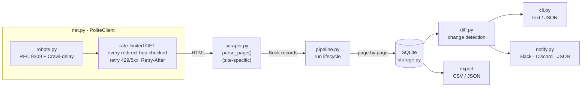
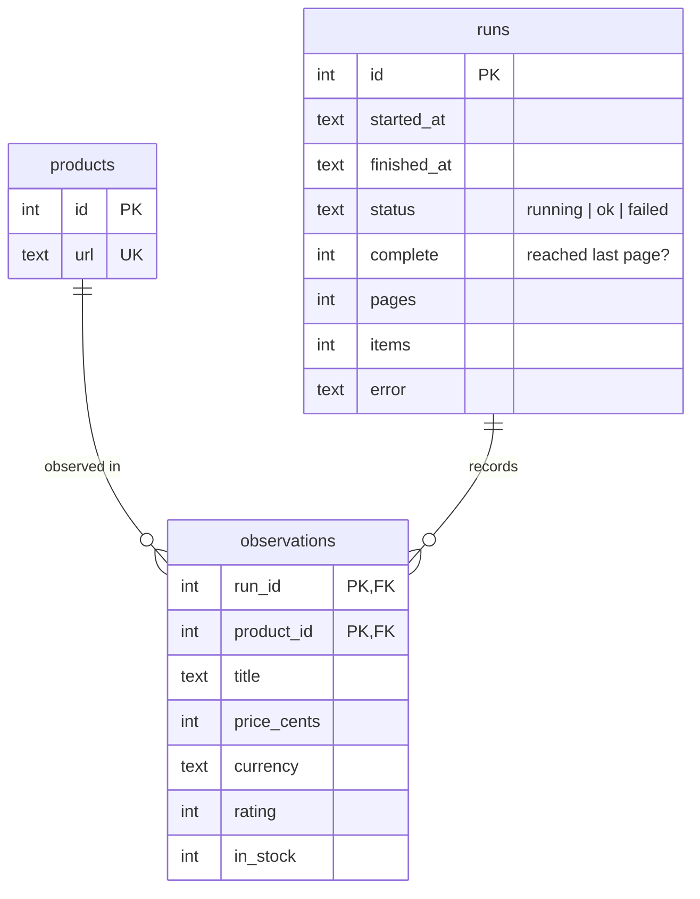

# BookWatch

[](https://github.com/exosphere8/bookwatch/actions/workflows/ci.yml)
[](https://github.com/exosphere8/bookwatch/actions/workflows/scrape.yml)


[](LICENSE)

**A polite, production-shaped price tracker.** BookWatch crawls a product catalogue, keeps the
full price history of every item in SQLite, tells you what changed since the last run (price
drops, rises, restocks, sell-outs, new and delisted products) and can push the result to Slack
or Discord.

The demo target is [books.toscrape.com](https://books.toscrape.com), a sandbox site built for
scraping practice. Only one function is site-specific, so it adapts to other catalogues in minutes.

```console
$ bookwatch scrape --pages 0
Run #7: 1000 products from 50 page(s) (full catalogue) saved to bookwatch.db

$ bookwatch changes
Changes found by run #7 (2026-10-19T05:23:38+00:00); previous successful run #6 (2026-10-15T05:23:41+00:00)

DROP      A Light in the Attic                              £51.77 -> £40.00  (-22.7%)
RISE      Sharp Objects                                     £47.82 -> £49.99  (+4.5%)
IN STOCK  Tipping the Velvet                                £53.74
NEW       The Midnight Library                              £18.99
DELISTED  Soumission                                        last seen at £50.10

$ bookwatch history "light in the attic"
A Light in the Attic
https://books.toscrape.com/catalogue/a-light-in-the-attic_1000/index.html

  RUN  SCRAPED (UTC)                  PRICE  STOCK
    5  2026-10-05T05:23:40+00:00     £51.77  in stock
    6  2026-10-12T05:23:41+00:00     £51.77  in stock
    7  2026-10-19T05:23:38+00:00     £40.00  in stock

trend  ██▁
low £40.00  high £51.77  now £40.00
```

*(Illustrative output: the sandbox site's prices are static, so real runs mostly report
"No changes". The tests exercise every change type.)*

## Features

- **Polite by construction.** A built-in RFC 9309 `robots.txt` parser (longest match, `*` and
  `$` wildcards, identical on every Python version) is checked on every request *and every
  redirect hop*. BookWatch applies `Crawl-delay`, rate-limits per host, and retries only transient
  failures (timeouts, truncated bodies, 429, 5xx) with exponential backoff that respects
  `Retry-After`.
- **Correct money.** Prices are parsed with `Decimal` and stored as integer minor units, never
  binary floats, so `£0.29` is exactly 29 pence. Ambiguous prices (`12,50 €`, `£1.999`, unknown
  currencies) are rejected, never guessed.
- **Full history, not just the last value.** A normalised schema of products, runs and
  observations answers "what did this cost three weeks ago?" directly.
- **Trustworthy reports.** Every scrape is recorded as a run. Failed or interrupted runs are kept
  for debugging but never feed reports, not even titles or dates. A crawl that parses zero
  products fails loudly. Each product is compared with its own last sighting, so a short crawl
  never hides a change, and every change is reported exactly once.
- **Safe upgrades.** Versioned, transactional schema migrations: a v1 database upgrades in place,
  and a failed migration leaves the file untouched.
- **Alerts.** `--notify` posts changes to a Slack or Discord webhook, or as raw JSON.
- **Scriptable.** JSON output for `changes` and `history`, CSV/JSON export, meaningful exit codes.
- **Engineered.** `mypy --strict`, ruff, 129 offline tests (fake HTTP transport and fake clock:
  no network, no sleeping, and a guard that fails any test touching the real network), a 90%
  coverage gate, and CI on Linux, Windows and macOS.

## Quick start

```bash
git clone https://github.com/exosphere8/bookwatch.git
cd bookwatch
python -m venv .venv && source .venv/bin/activate   # Windows: .venv\Scripts\activate
pip install -e .

bookwatch scrape                 # first 3 pages; --pages 0 crawls the whole catalogue
bookwatch scrape                 # ...later: take another snapshot
bookwatch changes                # what changed between the last two successful runs
```

## Commands

| Command | What it does |
|---|---|
| `bookwatch scrape [--pages N] [--delay S] [--start-url URL]` | Crawl and store a new run. `--pages 0` crawls everything; the run is marked *complete* only if it reached the last page. |
| `bookwatch changes [--min-pct P] [--json] [--notify URL]` | What the latest successful run found that changed; optionally ignore moves under `P` percent and send an alert. |
| `bookwatch history QUERY [--json]` | Price and stock history of one product (URL or part of the title), with a sparkline. |
| `bookwatch runs [--limit N]` | Recent runs: status, pages, items, and the error for failed runs. |
| `bookwatch export [--format csv\|json] [--out FILE]` | Latest known state of every product. |

Global options: `--db PATH` (or `BOOKWATCH_DB`), `-v` for progress logs, `-q` to silence status
lines. Reports and exports go to stdout and status lines and logs go to stderr, so piping is
always safe. Exit status is `0` on success, `1` on errors (network, robots.txt refusal, broken
markup, unusable database, unknown product), and `130` when interrupted.

### Alerts

```bash
export BOOKWATCH_WEBHOOK_URL="https://hooks.slack.com/services/..."   # keep it out of git
bookwatch changes --min-pct 5                                        # Slack format by default
bookwatch changes --notify-format discord --notify "$DISCORD_WEBHOOK"
```

A webhook is only called when there is something to report. If it fails, the error names only
the webhook's host, never the secret URL.

### Scheduling

- **cron**: `23 5 * * * cd /path/to/data && bookwatch -q scrape --pages 0 && bookwatch -q changes --min-pct 5`
- **Windows Task Scheduler**: run `bookwatch.exe` with the same arguments.
- **GitHub Actions**: [`scrape.yml`](.github/workflows/scrape.yml) runs twice a week, keeps the database
  in the Actions cache, writes the report to the run summary and uploads CSV/JSON artifacts.
  It never commits back to the repository.

## How it works



### Data model



### Design decisions

| Decision | Why |
|---|---|
| **Integer cents, not floats** | `0.29 * 100 == 28.999999999999996`. Equality on floats would invent price changes. |
| **Runs as first-class records** | A crash halfway through a crawl must not look like half the catalogue vanished. Everything a report shows (titles, prices, first and last seen) comes from `ok` runs only, and failed runs keep their error for debugging. |
| **Compare each product with its own last sighting** | Not just with the previous run: a shorter crawl last time can neither hide a change nor make an old product look new. |
| **"Delisted" only after a complete crawl, and only once** | A partial crawl cannot tell "removed" from "not reached". Only the first complete crawl after a product's last sighting reports it. |
| **Own robots.txt parser** | `urllib.robotparser` behaves differently across Python versions (rule precedence, wildcards, fractional `Crawl-delay`). Politeness should not depend on the interpreter. |
| **Zero products fails the run** | If the site changes its markup, silently storing nothing is the worst outcome, so the run fails loudly. |
| **Writes are per page, in a transaction** | Progress is durable and every page is all-or-nothing. Re-recording a product in the same run upserts instead of duplicating. |
| **SQLite + WAL** | Zero-ops, a single file, and safe for readers while a scrape is writing. Migrations re-check the version under the write lock, so concurrent processes never migrate twice. |
| **Fail fast on 4xx, retry 5xx/429** | Retrying a 404 never helps. Retrying an overloaded server should back off, and as much as it asks. |

## Adapting it to another site

Only [`parse_page()`](src/bookwatch/scraper.py) knows about HTML. Change its CSS selectors to
return `Book` records and a next-page URL, point `--start-url` at the first listing page, and
everything else works unchanged: history, diffing, alerts, export.
Check the site's terms of service and `robots.txt` first. BookWatch will refuse disallowed URLs.

## Development

```bash
pip install -e ".[dev]"
pytest -W error --cov          # 129 offline tests, coverage gate 90%
ruff check src tests && ruff format --check src tests
mypy                           # strict
```

```
src/bookwatch/
  scraper.py    HTML -> Book records (the only site-specific code)
  net.py        PoliteClient: redirects, crawl-delay, rate limiting, retries
  robots.py     RFC 9309 robots.txt parser
  pipeline.py   crawl -> parse -> store, with run lifecycle and data-quality gate
  storage.py    SQLite schema, migrations, upserts, queries
  diff.py       change detection between runs
  report.py     text rendering: tables, money, sparklines
  notify.py     Slack / Discord / JSON webhooks
  cli.py        argparse entry point
tests/          fake HTTP transport + fake clock: no network, no sleeps
```

See [CONTRIBUTING.md](CONTRIBUTING.md) and the [changelog](CHANGELOG.md).

## License

[MIT](LICENSE)
